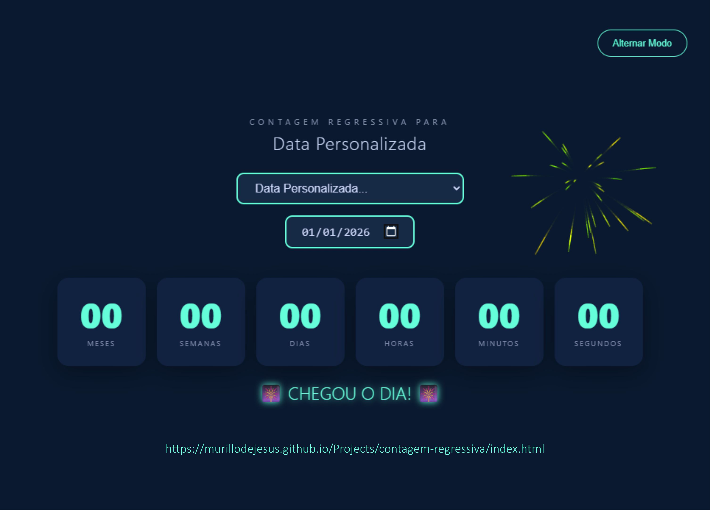

# ⏳ Countdown Interativo

Uma aplicação de contagem regressiva moderna e dinâmica que monitora feriados brasileiros e datas personalizadas.

  

# ⏳ Countdown Interativo
... resto do texto que já fizemos ...

## 🌟 Principais Funções
* **Contagem Inteligente:** Exibe o tempo restante detalhado em meses, semanas, dias, horas, minutos e segundos.
* **Feriados Automáticos:** Detecta inteligentemente o próximo feriado nacional a partir da data atual.
* **Personalização:** Opção para o usuário definir sua própria data especial via calendário.
* **Temas Customizáveis:** Suporte para Modo Escuro (Dark) e Modo Claro (Light) com transições suaves.
* **Celebração:** Animação de fogos de artifício usando **HTML5 Canvas** ao zerar o cronômetro.

## 🛠️ Tecnologias
* **HTML5 & CSS3:** Estrutura semântica, layout responsivo e uso de variáveis CSS para temas.
* **JavaScript (Vanilla):** Lógica para cálculos de datas e manipulação dinâmica do DOM.
* **Web Storage (localStorage):** Persistência das preferências de tema e feriados escolhidos pelo usuário.

## 📈 Aprendizado
Neste projeto, foquei em consolidar os seguintes conceitos:
1.  **Manipulação de Datas:** Cálculos matemáticos precisos com o objeto `Date`.
2.  **Canvas API:** Criação de animações gráficas e sistemas de partículas (fogos de artifício).
3.  **Experiência do Usuário (UX):** Salvamento de configurações para que a página mantenha o estado após o refresh.
4.  **Animações CSS:** Uso de `@keyframes` disparados via JS para feedback visual nos números.

---
**Desenvolvido por Murillo de Jesus 💻**
